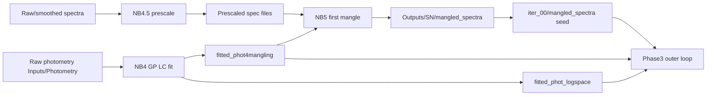
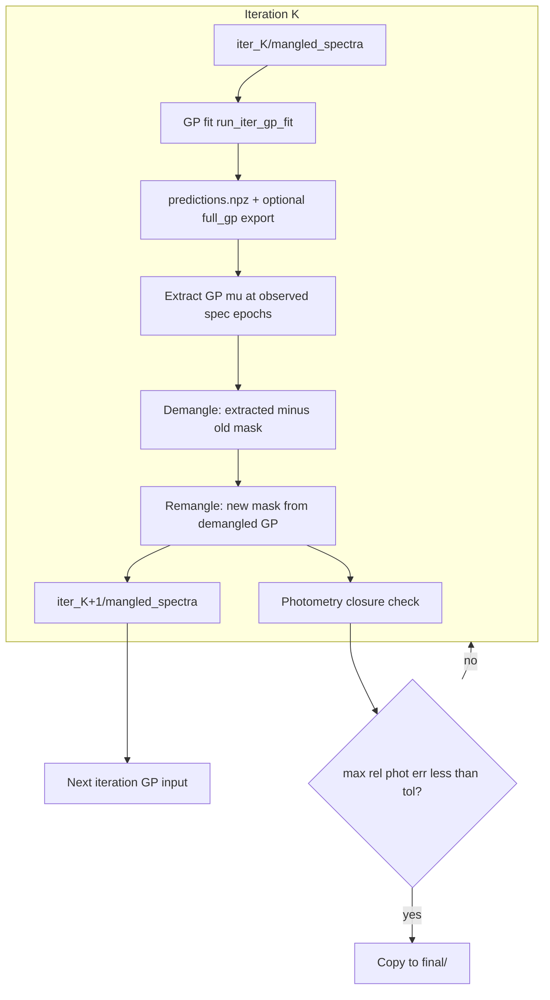

# Iterative Mangling Data-Flow Reference

This document traces the **Phase 3 production loop** (`run_iterative_gp_mangle` in [`iterative_gp_mangle.py`](../iterative_gp_mangle.py)): what physical data enters each step, what the code computes, and what gets written for the next iteration.

For deliverables, config knobs, and output layout, see [`PHASE3_ITER_GP_MANGLE.md`](PHASE3_ITER_GP_MANGLE.md).

**Scope:** Phase 3 only.  `bundle_scale_pipeline` / `iterate_gp_surface_bundle_scale` (linear per-bundle scaling in NPZ space) is a separate path and is **not** described here.

---

## Executive summary

The outer loop alternates between fitting a 2D GP surface on **mangled spectroscopy** and updating **wavelength-dependent mangling masks** so that prescaled spectra agree with **GP-fitted light curves** at each observed epoch. Each iteration:

1. Fits the GP on mangled spectra from the current iteration.
2. Extracts the GP prediction at each **real spectroscopy epoch** (not extrapolated LC-only times).
3. Removes the current mangling mask to recover a **demangled GP spectrum**.
4. Builds a new smooth log-space mask from synphot constraints vs NB4 photometry.
5. Applies that mask to **prescaled original spectra** (NB 4.5), producing input for the next GP fit.

The loop stops when synthetic photometry from prescaled + new mask matches the target LC within tolerance, or when the iteration cap is reached.

---

## 1. Pipeline context and prerequisites

Before Phase 3 runs, notebooks **0.1 → 1 → 2 → 4 → 4.5 → 5** must have produced the inputs below.



### Physical data sources

| Artifact | Notebook / origin | Physical content | Role in Phase 3 loop |
|----------|-------------------|------------------|----------------------|
| Prescaled spectra | NB 4.5 → `Inputs/Spectroscopy/2_spec_prescaled/<SN>/` | Smoothed, flux-rescaled spectroscopy on linear Å grids (XSHOOTER arms, etc.) | **Application target** for new masks; wavelength grid for GP extraction |
| Prescaled spec list | NB 4.5 → `Inputs/Spectroscopy/2_spec_lists_prescaled/<SN>.list` | MJD, phase, path per exposure arm | Defines which epochs exist and where files live |
| NB5 mangled spectra | NB 5 → `Outputs/<SN>/mangled_spectra/*.txt` | Prescaled spectra + first-pass log-space mangling mask | Seeds `iter_00/mangled_spectra/` |
| `fitted_phot4mangling_<SN>.dat` | NB 4 → `4_LCfit_KN_log.ipynb` | GP-smoothed multi-band LC in log₁₀ flux at each **spectroscopy MJD** | **Mangling constraint target** (what synphot must match) |
| `fitted_phot_logspace_<SN>.dat` | NB 4 (same fit) | GP LC evaluated on a dense log-phase grid | Places photometry on the **2D GP training grid**; not the mangling comparison table |
| Raw LC input to step 3 LCfit | `Inputs/Photometry/3_LCs_extrapolated/` | Band light curves from NB2 commit | Upstream of both phot tables |
| `<SN>_band_mjd_ranges.json` | Pipeline QA | Per-band valid MJD window | Gates which bands contribute constraints at each spec epoch |
| `<SN>_spec_scale_groups.json` | NB 4.5 | Exposure arms that share a flux scale factor | Bundle-aware shared mangling across arms |
| Filter curves | `Inputs/Filters/GeneralFilters/*.dat` (CSP/Swift variants) | Published transmission T(λ) | Trapezoid synthetic photometry |

**Example (AT2017gfo):** 38 prescaled-list entries (XSHOOTER UVB/VIS/NIR arms across ~13 epoch groups) → 38 extractions and 38 remangles per iteration.

---

## 2. Outer loop overview

Driver: [`run_iterative_gp_mangle`](../iterative_gp_mangle.py) (lines ~342–705).  
Notebook entry: [`6_Iterative_GP_mangle_KN.ipynb`](../6_Iterative_GP_mangle_KN.ipynb).

Output root: `Outputs/<SN>/twodim_iter/<extend|extrapolate>/`.



### Per-iteration steps (code order)

| Step | Module | Input (physical) | Output |
|------|--------|------------------|--------|
| 0. Seed (once) | `iterative_gp_mangle` | NB5 `mangled_spectra/` | `iter_00/mangled_spectra/` |
| 1. GP fit | [`iter_gp_grid.run_iter_gp_fit`](../iter_gp_grid.py) | Current mangled spectra + LC grid phot + optional 2D prior | `gp_runs/predictions.npz`, optional `full_gp/*_spec_extended*.txt` |
| 2. Extract | [`gp_surface_extract.extract_all_observed_epochs`](../gp_surface_extract.py) | GP μ surface + prescaled λ grids | `extracted/<mjd>_gp_extracted.txt` |
| 3. Demangle | `demangle_extracted_spectrum` | Extracted log flux + **current** mask from `iter_K/mangled_spectra` | `demangled/<mjd>_gp_demangled.txt` |
| 4. Remangle | [`remangle_spectra`](../iterative_gp_mangle.py) | Demangled GP spectra + `fitted_phot4mangling` | New masks → `iter_{K+1}/mangled_spectra/` |
| 5. Converge | `compute_photometry_closure` | Prescaled originals + **new** masks | `metrics.json`, stop if tolerance met |

---

## 3. GP spectra extraction

**Code:** [`gp_surface_extract.py`](../gp_surface_extract.py)

### What is extracted

The loop reads the GP posterior mean from `iter_K/gp_runs/predictions.npz`. The array key is `GP_PREDICT_MU_KEY` (default `"mu"`), which is the **post-processed** surface (mono+blue early-time corrections applied inside 2D GP). Use `"mu_raw"` only if configured for diagnostics.

Internally the GP stores predictions in **scaled ln(Fλ)** space. Extraction converts:

```
scaled μ  →  linear Fλ  (via offset/scale_factor in grid_norm_info)
         →  log₁₀(Fλ)   (written to disk)
```

This is the GP's model of the **mangled** spectral energy distribution at that epoch—the same quantity the 2D GP was trained to interpolate.

### Time range (which epochs)

Extraction is limited to **real spectroscopy epochs** listed in the prescaled spec list (`spec_list_path_for_mangling` → `2_spec_lists_prescaled/<SN>.list`).

For each list entry:

- **MJD** comes from the filename / list column (e.g. 57983.969003).
- **Phase** (log₁₀ days since explosion): `log10(max(MJD − t0_fix, 1e-5))`.

**Not extracted:** extrapolated LC-only phases, gap-fill columns inserted between spec epochs, early extrapolation columns, or dense predict-grid phases (`ITER_GP_DENSE_PREDICT_GRID` adds ~100 log-uniform phases to `X_fill` for GP prediction only—they are not demangled/remangled).

The GP **is** trained on a wider time grid (see below), but mangling feedback uses only observed spec times.

### Wavelength range

When `ITER_MANGLE_USE_GP_WAVELENGTH_GRID = True` (default), the GP slice is interpolated onto **`10**wls_log_grid`** from `predictions.npz` (~300 log-uniform points spanning the full GP training λ range). Flux still comes from the GP μ surface; only the **output λ sampling** changes.

When the flag is `False`, extraction uses the **prescaled arm grid** (legacy behavior).

Mechanics:

1. Select all prediction rows in `X_fill` whose normalized log-phase coordinate matches the target epoch (`x2_mask_for_phase`).
2. Map normalized log-λ coordinates back to log₁₀(λ).
3. Linearly interpolate log₁₀(Fλ) and uncertainty onto the target wavelength grid (GP or prescaled).

**GP λ grid (default iter):** full training/prediction span; bands outside any single arm's prescaled range can constrain mangling after demangle.

**Prescaled λ range (legacy / NB5):** native to each instrument arm (e.g. XSHOOTER UVB/VIS/NIR).

**Demangle:** the current mangling mask (stored on prescaled λ) is interpolated onto the extraction grid before subtracting: `demangled = extracted − interp(mask, prescaled→extract)`.

**GP internal rebin grid:** built in [`twodim_grid_prep.build_grid`](../twodim_grid_prep.py) with `ITER_GP_GRID_DELTA = 30` Å.

### Files written

| Path | Content |
|------|---------|
| `iter_K/extracted/<mjd>_gp_extracted.txt` | GP μ as log₁₀(Fλ) on prescaled λ; includes old mask column |
| `iter_K/demangled/<mjd>_gp_demangled.txt` | `extracted − old_mask` (see §4) |

### Contrast: full GP export (`full_gp/`)

When `ITER_GP_EXPORT_FULL_GP = True`, [`export_full_gp_spectra`](../gp_full_spectra_export.py) writes one spectrum per **training/prediction grid column**—including gap-fill, early extrapolation, and extension to the latest LC phase.

These files (`<Log_Phase>_spec_extended*.txt`) are for **QA and downstream NB7 rimangle**. They are **not** remangled inside the Phase 3 loop.

### GP training grid context (what the surface covers)

The 2D GP in `run_iter_gp_fit` trains on mangled spectra columns plus photometry from `fitted_phot_logspace_<SN>.dat` placed on an extended log-phase grid ([`twodim_grid_prep`](../twodim_grid_prep.py), `extrapolate_spectra` mode):

- **Observed spec columns:** log₁₀(phase-day) at each mangled epoch.
- **Early extrapolation:** 7 or 15 log-phase points over +1.5 dex before earliest LC point.
- **Gap fill:** interior phases every 0.1 d where gaps between spec epochs exceed 0.1 d (values interpolated from fitted LC, not new physics).
- **Late extension:** grid extends to max LC log-phase across bands.
- **Dense predict grid (iter only):** optional 100 log-uniform phases between min/max (`ITER_GP_DENSE_PREDICT_GRID`).

Photometry on extrap phases comes from interpolating the NB4 GP LC onto those log-phases; it constrains the GP surface but does not receive mangling updates.

---

## 4. Synthetic photometry

**Code:** [`mangle_spectra_log.band_flux_trapz`](../mangle_spectra_log.py)

### Method

Production mangling uses **trapezoid integration** with tabulated filter curves—not pysynphot.

For a spectrum (linear Å, linear Fλ):

1. Load filter transmission from `Inputs/Filters/...` (band-specific path for CSP/Swift).
2. Restrict to wavelengths where T(λ) is defined and overlap the spectrum.
3. Compute band-averaged flux:
   ```
   F_band = ∫ T(λ)·λ·F(λ) dλ / ∫ T(λ)·λ dλ
   ```
4. Convert to log₁₀ for comparison with LC tables.
5. Effective wavelength λ_eff and filter edges (min/max λ) are returned for constraint placement.

Uncertainty propagates through the trapezoid quadrature on `(T·λ·σ_F)`.

### Two uses in the loop

| When | Spectrum fed to synphot | Physical meaning |
|------|-------------------------|------------------|
| **Mask construction** | **Demangled GP spectrum** (linear flux from `demangled/` files) | "What flux does the GP surface predict **before** mangling?" |
| **Convergence check** | **Prescaled original + new mask**: `F_mangled = F_prescaled × 10^mask` | "After applying the updated mask to real prescaled data, do we match the LC?" |

### Demangling (why it matters)

Mangled spectra satisfy:

```
log₁₀(F_mangled) = log₁₀(F_prescaled) + mask(λ)
```

The GP is fit on mangled data, so extraction returns **mangled-level** log flux. Before building a new mask, the code removes the **current** iteration's mask:

```
log₁₀(F_demangled) = log₁₀(F_extracted) − mask_old(λ)
```

This yields an estimate of the underlying spectral shape implied by the GP surface, independent of the mangling applied so far. Synphot constraints on the demangled spectrum ask: "How much additive log flux (as a function of λ) is needed so this GP shape matches the target photometry?"

---

## 5. Comparison target (what synphot is matched to)

**File:** `Outputs/<SN>/fitted_phot4mangling_<SN>.dat`  
**Origin:** Step 3 GP LC fit (`3_LCfit_KN_log.py`) on photometry in `Inputs/Photometry/3_LCs_extrapolated/`.

### Physical meaning

This table stores **GP-smoothed, interpolated multi-band light curves** evaluated at each **spectroscopy epoch's MJD** (`spec_mjd` column). It is not raw observed photometry—it is the NB4 GP's best estimate of each band's log₁₀ flux at the time each spectrum was taken.

### Columns used per band

| Column | Meaning |
|--------|---------|
| `{band}_fit_log_flux` | Target log₁₀ band flux at this spec MJD |
| `{band}_fit_log_fluxerr` | Uncertainty on target |
| `{band}_inrange` | Whether this band is considered valid at this epoch |

### Gating

Two filters restrict which bands contribute:

1. **`{band}_inrange`** flag in the phot table.
2. **`<SN>_band_mjd_ranges.json`:** band is used only if `min_mjd ≤ spec_mjd ≤ max_mjd` for that filter.

### Constraint equation

For each valid band at epoch MJD:

```
log_diff = fitted_logphot − raw_logphot(demangled_GP_spectrum)
```

- `fitted_logphot` — from `fitted_phot4mangling` (NB4 GP LC).
- `raw_logphot` — log₁₀ of trapezoid synphot on the **demangled** GP spectrum at that band's λ_eff.

`log_diff` is the additive log-space correction the mangling mask must provide at λ_eff. Combined errors from LC and synphot feed the 1D GP fit in log-λ (§6).

### What is NOT used

- **Raw observed photometry:** `MANGLE_PHOTOMETRY_TARGET = "gp_fit"` is enforced in Phase 3 (`ALLOW_RAW_PHOTOMETRY_TARGET` must be True to override).
- **`fitted_phot_logspace_<SN>.dat` for mangling:** this file supplies photometry on the 2D GP **training grid** (log-phase rows). It shapes the GP surface but is not the remangle comparison table.

---

## 6. Mangling function construction

**Code:** [`compute_mangling_mask`](../mangle_spectra_log.py) (per epoch) and [`compute_mangling_mask_bundle`](../mangle_spectra_log.py) (bundle-aware groups)

### Input spectrum

The **demangled GP spectrum**: linear Fλ and σ_F on the extraction Å grid (GP prediction grid by default, or prescaled arm grid if `ITER_MANGLE_USE_GP_WAVELENGTH_GRID=False`), loaded from `demangled/<mjd>_gp_demangled.txt`.

### Step-by-step

1. **Collect band constraints.** For each in-range band, compute synphot on the demangled spectrum → `raw_logphot`. Pair with `fitted_logphot` from `fitted_phot4mangling` → `(log₁₀ λ_eff, log_diff)` with combined uncertainty.

2. **Fit smooth mask in log-λ.** Sparse constraints (typically a handful of bands per epoch) are interpolated across wavelength with a **1D George GP** (Matern 3/2 kernel in log₁₀ λ). The GP predicts a smooth additive mask `m(λ)` on a subsampled log-λ grid, then interpolates to all prescaled bins.

3. **Output.** `mangling_mask(λ)` — same length as the prescaled wavelength array, in **log₁₀ flux units** (additive in log space).

### Bundle-aware mode (`MANGLE_BUNDLE_AWARE = True`)

Multi-arm exposures (e.g. XSHOOTER UVB/VIS/NIR) in `<SN>_spec_scale_groups.json` share **one** mangling mask per scale group. Used by **NB5** (`run_mangle_pipeline`) and **Phase 3 remangle** via the same [`compute_mangling_mask_bundle`](../mangle_spectra_log.py).

**Constraint collection per filter** (`MANGLE_BUNDLE_STITCH_SYNPHOT = True` by default):

| Mode | When | Synphot input |
|------|------|---------------|
| GP grid | Phase 3 iter + `ITER_MANGLE_USE_GP_WAVELENGTH_GRID` | One full-length demangled GP SED per group |
| Stitched | ≥2 arms overlap filter **and** combined coverage > best single arm | Concatenated bins from all overlapping arms in `merge_order` (UVB/VIS/NIR/any) |
| Per-arm fallback | Only one arm overlaps, or stitched does not improve coverage | Best single-arm overlap (legacy) |

Stitched prescaled synphot integrates only existing arm bins—it cannot fill detector gaps between arms. GP-grid iter mode fills gaps via the 2D GP surface.

**Mask fit grid:** GP λ grid (iter GP mode) or union of arm prescaled λ bins (NB5 / prescaled iter).

Epochs not in any group use per-arm `compute_mangling_mask`.

### Relation to NB5

The algorithm is the same **NB5-style log-space mangling** in [`mangle_spectra_log.py`](../mangle_spectra_log.py). NB5 and Phase 3 share **`compute_mangling_mask_bundle`** including multi-arm stitched synphot. Phase 3 additionally uses GP-grid demangled spectra when `ITER_MANGLE_USE_GP_WAVELENGTH_GRID=True`.

---

## 7. Application target (what the new mask is applied to)

**Code:** [`remangle_spectra`](../iterative_gp_mangle.py) → `_apply_mask_to_prescaled`

### Applied to: prescaled originals (NB 4.5)

The new mask is **not** applied to:

- GP extended grid spectra (`full_gp/`)
- Demangled GP spectra (those were only used to **derive** the mask)
- Previous iteration's mangled files in place (new tree under `iter_{K+1}/`)

The application target is the **prescaled original** spectroscopy file from NB 4.5 (`Inputs/Spectroscopy/2_spec_prescaled/<SN>/...`), loaded via paths in the prescaled spec list.

### Formula

```
m_on_prescaled(λ) = interp(mangling_mask, λ_mask_grid → λ_prescaled)
mangled_log10(Fλ) = log10(Fλ_prescaled) + m_on_prescaled(λ)
```

The mask may be fit on the GP λ grid or demangled arm grid; it is always **interpolated in log-λ** onto each prescaled arm before application (`interpolate_mangling_mask_to_wls`).

### Output

Written to `iter_{K+1}/mangled_spectra/<mjd>_mangled_spec.txt`:

- log₁₀ λ, log₁₀ Fλ, log₁₀ σ, and the mask column.

These files become the **spectroscopic input to the next GP fit** (`run_iter_gp_fit` reads `mangled_spectra_dir`).

### Downstream note (out of Phase 3 scope)

NB7 rimangle (`7_Rimangle_KN_log*.ipynb`) applies a **separate** mangling pass to **GP extended spectra** (`ext_spec_linear`) for final `FINAL_spec` products. That step is not part of the iterative loop documented here.

---

## 8. Convergence, outputs, and config

### Convergence criteria

| Criterion | Config | Default | Role |
|-----------|--------|---------|------|
| Primary stop | `PHOT_CONVERGENCE_FRAC` | `0.05` | Stop when max relative synphot error (prescaled + new mask vs `fitted_phot4mangling`) < 5% |
| Iteration cap | `ITER_GP_MANGLE_MAX_ITERS` | `20` | Hard stop |
| Secondary log | `MASK_CONVERGENCE_EPS` | `1e-4` | RMS Δmask between iterations (logged; not primary stop) |

Relative error is computed over all valid band–epoch pairs in `compute_photometry_closure`.

### Final artifacts

After the loop, the last iteration's GP predictions and the **next** iteration's mangled spectra are copied to:

```
Outputs/<SN>/twodim_iter/<mode>/final/
  full_gp/predictions.npz
  full_gp/<Log_Phase>_spec_extended*.txt
  mangled_spectra/
  convergence_report.json
```

Optional QA export (`ITER_EXPORT_FINAL_SPEC_FOR_QA`): `Outputs/<SN>/FINAL_spectra_2dim/twodim_iter/.../as_observed/`.

Per-iteration metrics: `iter_K/metrics.json` (`n_extractions`, `n_remangled`, `max_rel_phot_err`, `delta_mask_rms`, …).  
Aggregate log: `iteration_log.jsonl`.

### Key config flags

| Flag | Default | Role |
|------|---------|------|
| `GP_PREDICT_MU_KEY` | `"mu"` | GP surface used for extraction |
| `ITER_MANGLE_USE_GP_WAVELENGTH_GRID` | `True` | Extract/demangle on full GP λ grid (iter only) |
| `MANGLE_BUNDLE_STITCH_SYNPHOT` | `True` | Multi-arm stitched synphot in bundle groups (NB5 + iter) |
| `MANGLE_BUNDLE_AWARE` | `True` | Shared mask per NB 4.5 scale group |
| `MANGLE_PHOTOMETRY_TARGET` | `"gp_fit"` | Use `fitted_phot4mangling` only |
| `ITER_GP_SEED_FROM_NB5` | `True` | Copy NB5 → `iter_00/mangled_spectra` |
| `ITER_GP_WARM_START` | `True` | Warm-start GP hypers from previous iter |
| `ITER_GP_GRID_DELTA` | `30.0` | Å step for GP log-λ rebin |
| `ITER_GP_DENSE_PREDICT_GRID` | `True` | Add dense log-phase columns on X_fill |
| `ITER_GP_DENSE_PREDICT_GRID_N` | `100` | Number of dense phase columns |
| `ITER_GP_EXPORT_FULL_GP` | `True` | Write extended spectra each iter |
| `ITER_SAVE_DIAGNOSTICS` | `True` | PDFs/PNGs under `iter_K/diagnostics/` |

Full list: [`pipeline_config.py`](../pipeline_config.py) (`ITER_*`, `MANGLE_*`).

---

## File-path quick reference

| Role | Path pattern |
|------|--------------|
| Prescaled originals | `Inputs/Spectroscopy/2_spec_prescaled/<SN>/*.dat` |
| Prescaled list | `Inputs/Spectroscopy/2_spec_lists_prescaled/<SN>.list` |
| NB5 seed mangled | `Outputs/<SN>/mangled_spectra/*.txt` |
| Mangling phot target | `Outputs/<SN>/fitted_phot4mangling_<SN>.dat` |
| GP grid phot | `Outputs/<SN>/fitted_phot_logspace_<SN>.dat` |
| Band MJD windows | `Outputs/<SN>/<SN>_band_mjd_ranges.json` |
| Scale groups | `Outputs/<SN>/<SN>_spec_scale_groups.json` |
| Filters | `Inputs/Filters/GeneralFilters/<band>.dat` |
| Iter root | `Outputs/<SN>/twodim_iter/<mode>/` |
| GP predictions | `.../iter_K/gp_runs/predictions.npz` |
| Extracted / demangled | `.../iter_K/extracted/`, `.../iter_K/demangled/` |
| Next mangled input | `.../iter_{K+1}/mangled_spectra/` |
| Final products | `.../final/full_gp/`, `.../final/mangled_spectra/` |

---

## What this loop does NOT do

- **Does not remangle the GP extended grid** inside Phase 3 (`full_gp/` is export/QA only until NB7).
- **Does not use `bundle_scale_pipeline`** (linear NPZ scaling between surfaces—that is a separate optional path in `twodim_gp/`).
- **Does not compare against raw observed photometry** by default (NB4 GP-fitted LC only).
- **Does not update mangling at LC-only extrapolated phases**—only real spectroscopy epochs from the prescaled list receive mask updates.
