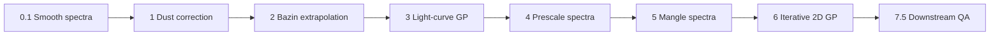

# kn-sed-pipeline

Building time-evolving spectral energy distribution (SED) templates for kilonovae and other transients from multi-band photometry and sparse spectroscopy.

This repository is a log-space reconstruction pipeline. It fits each photometric band with a one-dimensional Gaussian Process, aligns multi-arm spectroscopy onto a common flux scale, applies wavelength-dependent mangling so that synthetic photometry matches the light-curve fit, and then iterates a two-dimensional Gaussian Process over wavelength and phase until the mangling and the surface converge. The default worked example is **AT2017gfo** (the optical counterpart of GW170817).

For day-to-day operational detail (every flag, input column, and output path), see the [Pipeline User Guide](docs/PIPELINE_USER_GUIDE.md). For the scientific equations and rationale behind each stage, see the [Pipeline Writeup](docs/PIPELINE_WRITEUP.md) (PDF: [PIPELINE_WRITEUP.pdf](docs/PIPELINE_WRITEUP.pdf)).

---

## Documentation

| Document | Description |
|----------|-------------|
| [**User guide (full)**](docs/PIPELINE_USER_GUIDE.md) | Step-by-step run instructions, input formats, notebooks, scripts, configuration, troubleshooting |
| [PDF user guide](docs/PIPELINE_USER_GUIDE.pdf) | Offline copy — build with `docs/build_user_guide_pdf.sh` (needs pandoc) |
| [**Scientific writeup**](docs/PIPELINE_WRITEUP.md) | Equations and scientific description of every pipeline stage |
| [PDF writeup](docs/PIPELINE_WRITEUP.pdf) | Offline copy — build with `docs/build_writeup_pdf.sh` (needs pandoc and pdflatex) |
| [Prescale (step 4)](Codes/helper_scripts/docs/PHASE1_PRESCALE.md) | Scale groups, seams, and arm bridging |
| [Iterative GP (step 6)](Codes/helper_scripts/docs/PHASE3_ITER_GP_MANGLE.md) | Outer-loop internals and convergence |
| [Iterative data flow](Codes/helper_scripts/docs/ITERATIVE_MANGLING_DATA_FLOW.md) | Physical inputs and outputs of each remangle iteration |
| [Downstream QA](Codes/helper_scripts/docs/PHASE4_DOWNSTREAM_QA.md) | How notebooks 7.5 read final products |
| [Deprecated modules](Codes/helper_scripts/docs/DEPRECATED_REMOVED.md) | Removed or superseded code log |

---

## What you will need

- **Python 3.10 or newer** (3.12 is tested).
- The packages listed in [`requirements.txt`](requirements.txt). The most important non-standard dependency is **george** (Gaussian Process library, version 0.4.3 or newer; see https://george.readthedocs.io/). You will also need numpy, scipy, pandas, matplotlib, astropy, extinction, synphot, and jupyter for the preparation notebooks.
- An environment variable **`COCO_PATH`** pointing at the root of this cloned repository (the folder that contains `Codes/`, `Inputs/`, and `Outputs/`).

---

## Build your own template: instructions

### STEP 0: Clone the repository and set up the environment

1. Clone this repository to a convenient location on your machine.
2. Set the environment variable `COCO_PATH` to that location. For example:

```bash
export COCO_PATH="/path/to/kn-sed-pipeline"
```

Add the same line to your shell startup file (`.bashrc`, `.zshrc`, and so on) if you want it to persist across sessions.

3. Create a virtual environment and install dependencies:

```bash
cd "$COCO_PATH"
python -m venv .venv
source .venv/bin/activate
pip install -r requirements.txt
```

4. (Optional, recommended for servers or batch runs.) Force matplotlib to use a non-interactive backend so plots can be written without a display:

```bash
export MPLBACKEND=Agg
```

The production scripts under `Codes/` already set this where needed, but setting it in your shell avoids surprises when you import plotting helpers interactively.

---

### STEP 1: Prepare inputs

All inputs (photometry, spectroscopy, filter transmission curves, and supernova metadata) live under `./Inputs`. You need to prepare three kinds of data before you start running the production scripts. The AT2017gfo example already shipped in this repository illustrates the expected formats.

#### 1. Photometry

Place photometry in flux units under the staged folders in `Inputs/Photometry/`. The pipeline uses these stages in order:

| Folder | Role |
|--------|------|
| `Inputs/Photometry/1_LCs_flux_raw/` | Observed fluxes before dust correction (also used to build band Modified Julian Date windows) |
| `Inputs/Photometry/2_LCs_dust_corrected/` | Dust-corrected fluxes written by notebook 1 |
| `Inputs/Photometry/3_LCs_extrapolated/` | Early- and late-time extrapolated light curves written by notebook 2; **this is the input to step 3** |

Each light-curve file is named `<SN>.dat` (for example `AT2017gfo.dat`). After notebook 2, a typical extrapolated file has a header row and columns such as:

```text
MJD  band  Flux  Flux_err  FilterSet  Instr  Phase  Log_Phase  Log_Flux  Log_Flux_err
```

A raw-flux file under `1_LCs_flux_raw/` may instead look like:

```text
MJD,Mag,Mag_err,Flux,Flux_err,band,Instr,FilterSet
57982.981,17.48,0.02,2.23070668586e-16,4.10911340341e-18,Swope_i,E2V4kx4kccd,GeneralFilters
```

**If your photometry is already dust-corrected and already extended at early and late times** (or you do not want those steps), you may skip notebooks 1 and 2 and place the finished light curve directly in `Inputs/Photometry/3_LCs_extrapolated/<SN>.dat`. You still need a raw-flux file under `1_LCs_flux_raw/` so that step 5 can build per-band Modified Julian Date validity windows when they are missing.

#### 2. Spectroscopy

For each transient you need:

1. A **spectrum list** file under `Inputs/Spectroscopy/1_spec_lists_original/` (or, after smoothing, under `2_spec_lists_smoothed/`).
2. The **spectrum data files** themselves under `Inputs/Spectroscopy/1_spec_original/<SN>/` (or `2_spec_smoothed/<SN>/` after notebook 0.1).

Each list file is named `<SN>.list` and has three whitespace-separated columns: Modified Julian Date, phase in days since explosion (often filled later), and the absolute or repository-relative path to the spectrum file. Example:

```text
57983.018250	0.000000	/path/to/Inputs/Spectroscopy/2_spec_smoothed/AT2017gfo/57983.01825_LDSS3_Magellan.dat
57983.969001	0.950751	/path/to/.../NIR_AT2017gfo_ENGRAVE_v1.0_XSHOOTER_MJD-57983.969001_Phase+1.43d.dat
```

Each spectrum file is a simple ASCII table with wavelength in angstroms, flux, and flux error. Example:

```text
#wls	flux	flux_err
3725.6000	1.8021e-15	4.1786e-16
3727.6000	1.7594e-15	4.1786e-16
```

XSHOOTER arms are typically named with `UVB_`, `VIS_`, or `NIR_` prefixes so that step 4 can group them. Single-arm instruments such as LDSS3 appear as one file per epoch.

**If you do not want to smooth**, skip notebook 0.1 and place both the list and the spectra under the smoothed folders (`2_spec_lists_smoothed/` and `2_spec_smoothed/`).

After step 4, the pipeline writes **prescaled** spectra to `Inputs/Spectroscopy/2_spec_prescaled/<SN>/` and a matching list under `2_spec_lists_prescaled/`. Steps 5 and 6 read those by default.

#### 3. Supernova metadata and configuration

- Edit or extend `Inputs/SNe_Info/info.dat` with a row for each new transient (coordinates for Milky Way extinction, type fields, and related metadata used by the dust notebook).
- Set the explosion (or merger) Modified Julian Date and redshift in [`Codes/pipeline_config.py`](Codes/pipeline_config.py) under `SN_EXPLOSION_MJD` and `SN_REDSHIFT`. For AT2017gfo these are already filled in.
- Filter transmission curves live under `Inputs/Filters/GeneralFilters/`. Band colors, markers, and exclusion lists for plots are controlled by [`Codes/filter_plot_config.json`](Codes/filter_plot_config.json).

#### 4. Optional two-dimensional prior

The folder `Inputs/2DIM_priors/` holds surface priors used by the two-dimensional Gaussian Process. The default iteration path uses a flat prior unless you point `ITER_GP_PRIOR_FILE` in `pipeline_config.py` at another file.

---

### STEP 2: Run the pipeline

All outputs (light-curve fits, mangled spectra, diagnostic plots, and the final SED surface) are written under `Outputs/<SN>/`. Preparation notebooks live in `Codes/` alongside the production Python drivers. A typical notebook is organized as: path and import cells, configuration cells, then run and save cells.

The overall flow is:



- Notebooks **0.1 → 1 → 2** prepare smoothed spectra and extrapolated photometry.
- Scripts **3 → 4 → 5 → 6** are the production chain you re-run most often.
- Notebooks **7.5** and related scripts inspect the final products.

#### Preparation notebooks (interactive)

From Jupyter, open and run in order:

1. **`Codes/0.1_Smooth_spectra_KN.ipynb`** — Smooths raw spectra and writes `Inputs/Spectroscopy/2_spec_smoothed/<SN>/` plus `2_spec_lists_smoothed/<SN>.list`.
2. **`Codes/1_LC_DustCorrection_KN.ipynb`** — Applies Galactic (and optional host) dust correction and writes `Inputs/Photometry/2_LCs_dust_corrected/<SN>.dat`.
3. **`Codes/2_LC_modelRising_KN_fullfit_log.ipynb`** — Fits early-time rising models (Bazin and related forms), commits the explosion Modified Julian Date used downstream, and writes the extrapolated light curve to `Inputs/Photometry/3_LCs_extrapolated/<SN>.dat`.

Confirm that `SN_EXPLOSION_MJD` in `pipeline_config.py` matches the explosion time you committed in notebook 2.

#### Production scripts (command line)

From a shell with `COCO_PATH` set and the virtual environment activated:

```bash
cd "$COCO_PATH/Codes"

# Optional: wipe prior outputs for this supernova (directory kept)
python clear_sn_run.py --snname AT2017gfo --yes

# Step 3 — per-band Gaussian Process light-curve fit in log flux
python 3_LCfit_KN_log.py --snname AT2017gfo

# Step 4 — write scale-group JSON, edit it, then apply arm scaling
python 4_Scale_spectra_KN.py --snname AT2017gfo --write-groups-only
# Edit Outputs/AT2017gfo/AT2017gfo_spec_scale_groups.json if needed
# (confirm XSHOOTER UVB/VIS/NIR triplets and merge_order)
python 4_Scale_spectra_KN.py --snname AT2017gfo

# Step 5 — first-pass log-space mangling to the light-curve fit
python 5_Mangle_spectra_KN_log.py --snname AT2017gfo --save-epoch-plots

# Step 6 — iterative two-dimensional Gaussian Process + re-mangle loop
python 6_Iterative_GP_mangle_KN.py --snname AT2017gfo --max-iters 20 --verbose
```

What each script does, in brief:

| Step | Driver | What it does | Key products |
|------|--------|--------------|--------------|
| 3 | `3_LCfit_KN_log.py` | Fits each band’s light curve in log₁₀ flux with a one-dimensional Gaussian Process; evaluates the fit at every spectroscopy Modified Julian Date | `Outputs/<SN>/fitted_phot4mangling_<SN>.dat`, `fitted_phot_logspace_<SN>.dat` |
| 4 | `4_Scale_spectra_KN.py` | Groups near-simultaneous arms and applies multiplicative flux scales so seams match | `Inputs/.../2_spec_prescaled/`, `<SN>_spec_scale_groups.json`, `<SN>_spec_scale_report.json` |
| 5 | `5_Mangle_spectra_KN_log.py` | Builds a smooth wavelength-dependent mangling mask so synthetic photometry matches the step-3 fit; applies it to prescaled spectra | `Outputs/<SN>/mangled_spectra/`, `figs/mangle_epoch/`, `figs/mangle_nb5/` |
| 6 | `6_Iterative_GP_mangle_KN.py` | Fits a two-dimensional Gaussian Process on mangled spectra + photometry, extracts, demangles, remangles, and repeats until photometry closure or the iteration cap | `Outputs/<SN>/twodim_iter/` |

The pause between the two step-4 commands is intentional. After `--write-groups-only`, open `Outputs/<SN>/<SN>_spec_scale_groups.json` and confirm that multi-arm exposures (for example XSHOOTER UVB, VIS, and NIR) are listed together with a sensible `merge_order`. Then run step 4 again without that flag to write the prescaled files.

#### Optional downstream notebooks

After step 6 finishes, you can inspect and publish results with:

- `Codes/7.5_comparison_check_log.ipynb` — synthetic photometry versus the light-curve fit
- `Codes/7.5_spectra.ipynb` / `Codes/7.5_alternate.ipynb` — spectrum overlays
- `Codes/bolometric_luminosity.ipynb` — bolometric constructions
- `Codes/LCfit_publication_plots.ipynb` / `Codes/plotting-final.ipynb` — publication figures

Set `USE_ITER_GP_MANGLE_FINAL = True` in `pipeline_config.py` (the default) so these notebooks read products from `twodim_iter/final/` rather than older legacy paths.

---

### STEP 3: Outputs and quality assurance

After a full AT2017gfo run, the important layout under `Outputs/AT2017gfo/` looks like this:

```text
Outputs/<SN>/
  fitted_phot4mangling_<SN>.dat     # Step 3: LC fit at spectroscopy epochs
  fitted_phot_logspace_<SN>.dat     # Step 3: dense log-phase LC grid for 2D GP
  mangled_spectra/                  # Step 5: first-pass mangled spectra
  figs/mangle_epoch/                # Step 5: per-epoch mangling plots
  figs/mangle_nb5/                  # Step 5: HTML/PDF diagnostics
  twodim_iter/
    iter_KK/figs/gp_surface/        # 2D GP heatmaps, slices, training residuals
    iter_KK/figs/gp_vs_mangled/     # Primary SED QA (GP vs mangled, full λ span)
    iter_KK/figs/mangle_delta/      # New vs previous mangling
    iter_KK/figs/residuals/         # Residuals versus uncertainty
    iter_KK/figs/phot_lc/           # Photometry closure plots
    metrics/                        # chi-squared and lengthscales vs iteration
    final/full_gp/                  # Final extended GP spectra
    diagnostics_summary/index.html  # Clickable summary of iteration QA
  FINAL_spectra_2dim/               # QA-named copies for notebooks 7.5
```

In `gp_vs_mangled` individual plots, the horizontal axis is the **full prescaled (native instrument) wavelength range**. The Gaussian Process curve is interpolated onto that grid for comparison. Group plots stitch multi-arm exposures before plotting.

#### Resetting a run

To clear products for one supernova and start clean:

```bash
cd "$COCO_PATH/Codes"
python clear_sn_run.py --snname AT2017gfo --yes
```

By default this empties `Outputs/<SN>/` but keeps the directory. To also delete intermediate **prescaled** spectroscopy (so that step 4 must be re-run), add `--include-input-intermediates` (this requires `--yes`):

```bash
python clear_sn_run.py --snname AT2017gfo --include-input-intermediates --yes
```

Use `--dry-run` first if you want to see which paths would be removed.

---

## Configuration

Shared defaults live in [`Codes/pipeline_config.py`](Codes/pipeline_config.py). Edit that file (or override via command-line flags where supported) for:

- Default supernova name, explosion Modified Julian Date, and redshift
- Whether steps 5 and 6 read prescaled lists (`USE_PRESCALED_SPECTRA`)
- Bundle-aware mangling (`MANGLE_BUNDLE_AWARE`) and mangling kernel mode (`MANGLE_GP_KERNEL_MODE`, default `fixed_5` for PyCoCo parity)
- Iteration cap and photometry convergence fraction (`ITER_GP_MANGLE_MAX_ITERS`, `PHOT_CONVERGENCE_FRAC`)
- Whether remangle constraints use the full Gaussian Process wavelength grid (`ITER_MANGLE_USE_GP_WAVELENGTH_GRID`, default `True`)

Band colors and exclusions for plots are in [`Codes/filter_plot_config.json`](Codes/filter_plot_config.json).

---

## Tests

From the `Codes/` directory:

```bash
cd "$COCO_PATH/Codes"
PYTHONPATH=.:helper_scripts python -m unittest discover -s helper_scripts/tests -v
```

---

## Building the PDF manuals

```bash
# User guide PDF
docs/build_user_guide_pdf.sh

# Scientific writeup PDF (needs pandoc + a TeX distribution with pdflatex)
docs/build_writeup_pdf.sh
```

---

## Further reading

- Vincenzi et al. (2019), PyCoCo templates: https://arxiv.org/abs/1908.05228
- Bazin et al. (2011) light-curve functional form (used in notebook 2): https://arxiv.org/abs/1109.0948
- The vendored two-dimensional Gaussian Process engine under `Codes/helper_scripts/twodim_gp/` follows the collaborator configuration documented in the scientific writeup (additive Matérn 5/2 kernels, per-class jitter floors, early-time constraints).
